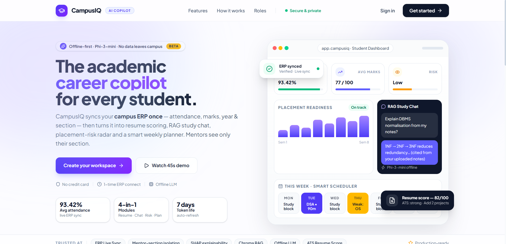
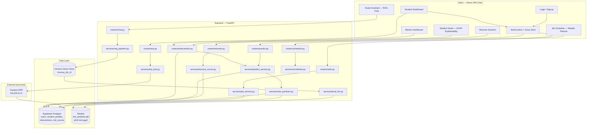
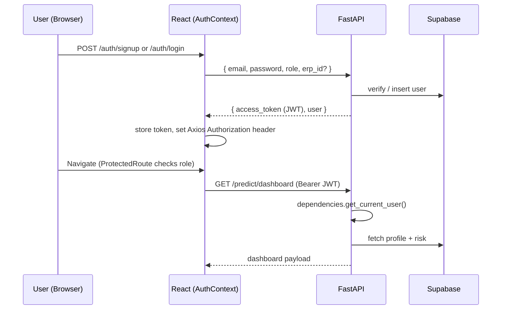
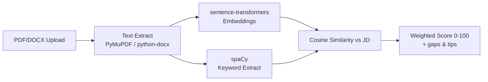
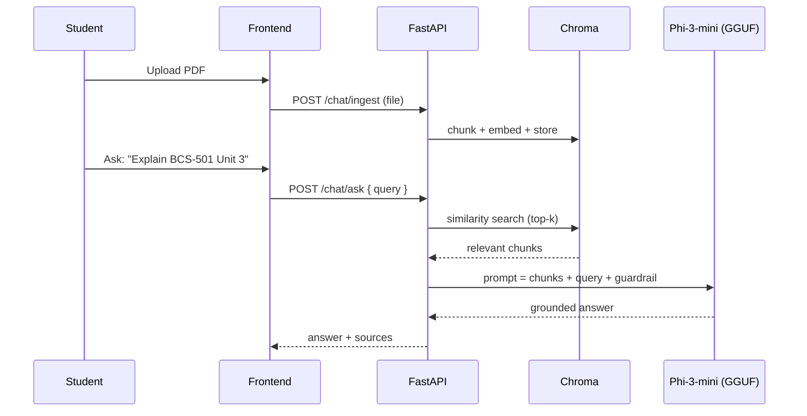
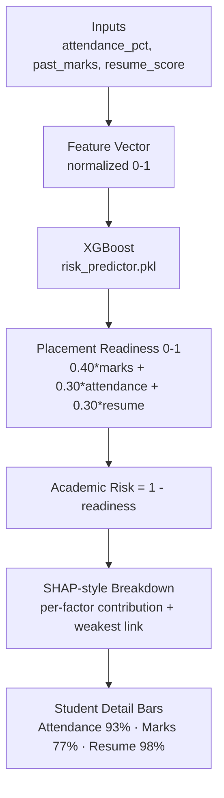
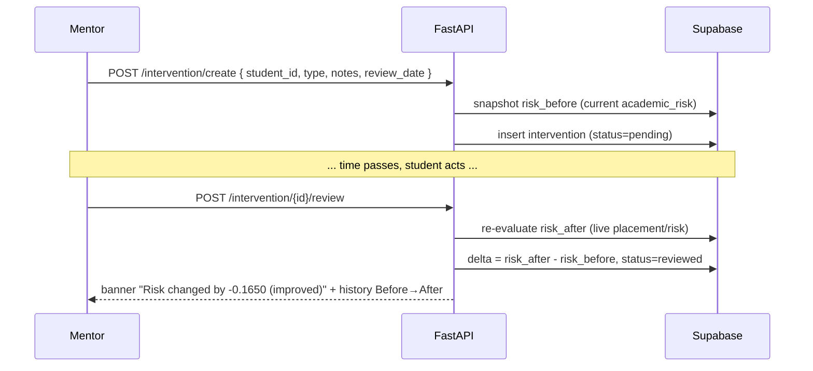

# CampusIQ — AI Academic & Career Copilot

<p align="center">
  
</p>

<p align="center">
  <a href="https://github.com/Aditya-dxt/Campus-IQ-2.O"></a>
  
  
  
  
</p>

> **Production-ready, privacy-first academic workspace** — resume scoring, RAG study chat (fully offline), risk prediction with SHAP explainability, smart weekly planner, and a closed-loop mentor intervention system. Role-based (Student / Mentor), ERP-connected, dark/light polished UI.

---

## Table of Contents

- [Highlights](#highlights)
- [Tech Stack](#tech-stack)
- [Architecture](#architecture)
- [Database — ER Diagram](#database--er-diagram)
- [Project Structure](#project-structure)
- [Quick Start](#quick-start)
- [Environment Variables](#environment-variables)
- [Database Migrations](#database-migrations)
- [Running Locally](#running-locally)
- [API Reference](#api-reference)
- [Roles & Access Control](#roles--access-control)
- [Core Features Deep Dive](#core-features-deep-dive)
- [ML Pipelines](#ml-pipelines)
- [Deployment](#deployment)
- [Screenshots](#screenshots)
- [Roadmap](#roadmap)
- [Contributing](#contributing)
- [License](#license)

---

## Highlights

| Module | What it does | Key tech |
|---|---|---|
| **Resume Scanner** | PDF/DOCX → ATS score vs Job Description (semantic + keyword) | `sentence-transformers`, `spaCy`, cosine similarity |
| **RAG Study Assistant** | Upload syllabus/notes → ask questions, grounded answers only | `Chroma`, `Phi-3-mini GGUF` via `llama-cpp-python`, anti-hallucination guardrail |
| **Risk Predictor** | Placement readiness & academic risk (0–1) with per-factor breakdown | `XGBoost`, `SHAP`, formula `0.40·marks + 0.30·attendance + 0.30·resume` |
| **Smart Scheduler** | Weekly plan from deadlines + weak subjects + risk — check-off progress | Rule-based priority engine, `localStorage` + event bus |
| **Intervention Loop** | Mentor logs action → snapshots `risk_before` → re-evaluates `risk_after` → delta | Closed-loop `interventions` table, RBAC cohort isolation |

Additional polish: **SHAP explainability bars** on Student Detail, **weekly progress ring** (real check-offs, not mock), **ERP sync** (attendance + marks live), **responsive** Tailwind UI with Navbar/Sidebar/AppLayout.

---

## Tech Stack

| Layer | Technology |
|---|---|
| **Frontend** | React 19 + Vite 8, React Router 7, Tailwind CSS 4, Recharts, Axios, Context API |
| **Backend** | FastAPI, Python 3.10, Pydantic, PyJWT, Uvicorn |
| **Database** | Supabase (Postgres) — Row Level Security + JWT |
| **Vector Store** | Chroma (local `chroma_db_v3`) |
| **LLM** | Phi-3-mini GGUF (offline, `llama-cpp-python`) — no data leaves device |
| **ML** | scikit-learn, XGBoost, SHAP, sentence-transformers, spaCy, pandas/numpy/joblib |
| **Infra** | Render (backend), Vercel (frontend), `render.yaml` |
| **Auth** | Email/password + JWT (`JWT_SECRET`, `JWT_EXPIRE_MINUTES`), ERP one-time connect |

---

## Architecture



### Request Flow (Auth)



---

## Database — ER Diagram

```mermaid
erDiagram
    users ||--o| student_profiles : "1:1 (student)"
    users ||--o{ interventions : "mentor creates"
    student_profiles ||--o{ interventions : "1:N (student_id)"
    users ||--o{ risk_scores : "student has many"
    users ||--o{ resumes : "uploads"

    users {
        uuid id PK
        string email UK
        string password_hash
        string name
        string role "student | mentor"
        string branch
        string coordinator_section "mentor cohort, e.g. CS-III-M"
        string erp_id
        string erp_password_enc
        timestamp created_at
    }
    student_profiles {
        uuid user_id PK_FK
        float attendance_pct
        float past_marks
        float resume_score
        string year
        string section
        jsonb marks_by_test
        timestamp updated_at
    }
    interventions {
        uuid id PK
        uuid student_id FK
        uuid mentor_id FK
        string type
        string notes
        float risk_before
        float risk_after
        string status "pending | reviewed"
        date review_date
        timestamp created_at
    }
    risk_scores {
        uuid id PK
        uuid student_id FK
        float placement_readiness
        float academic_risk
        jsonb breakdown
        timestamp created_at
    }
```

Migrations: `backend/migrations/001_init.sql` → `005_mentor_student_erp.sql` (see [Database Migrations](#database-migrations)).

---

## Project Structure

```
campus-iq-2.O/
├── README.md                 # ← you are here (root)
├── LICENSE                   # MIT
├── render.yaml               # Render deploy config (backend)
├── ppt.pdf / pres.pptx       # Viva presentation
├── ppt_images/               # Slide exports
│
├── backend/                  # FastAPI — see backend/README.md
│   ├── main.py               # App entry, CORS, router mount
│   ├── config.py             # Env / settings
│   ├── dependencies.py       # get_current_user, role guards
│   ├── requirements.txt
│   ├── models/
│   │   ├── auth.py           # Pydantic schemas (signup/login)
│   │   ├── risk_predictor.pkl
│   │   └── phi3-mini.gguf    # Downloaded on first run (~3.8GB, gitignored)
│   ├── routers/              # auth, erp, resume, chat, predict, schedule, intervention
│   ├── services/             # erp_psit, resume_scorer, rag_pipeline, risk_predictor, predict_service, scheduler, local_llm, jwt/supabase
│   ├── migrations/           # 001_init → 005_mentor_student_erp
│   └── scripts/              # download_model, seed_demo, test_e2e, run_interventions
│
├── frontend/                 # React (Vite) — see frontend/README.md
│   ├── index.html
│   ├── vite.config.js
│   ├── vercel.json
│   ├── src/
│   │   ├── App.jsx           # Routes + ProtectedRoute
│   │   ├── main.jsx / index.css / App.css
│   │   ├── api/              # auth, erp, resume, chat, predict, schedule, intervention, client
│   │   ├── context/          # AuthContext (JWT, user, dashboardPath)
│   │   ├── components/       # Navbar, Sidebar, AppLayout, ErpConnectModal, RiskTable, ScheduleView, ...
│   │   ├── pages/            # Login, Signup, StudentDashboard, MentorDashboard, StudentDetail, ResumeScanner, StudyAssistant, MySchedule, StudentInterventions, Profile
│   │   └── utils/            # risk.js (labels, colors, formatters)
│   └── dist/                 # Build output (gitignored)
│
├── ml/                       # ML pipelines — see ml/README.md
│   ├── predictor/            # XGBoost risk model (train / evaluate / SHAP / synthetic data)
│   ├── resume_matching/      # Sentence-Transformers + spaCy eval
│   ├── rag_eval/             # Anti-hallucination RAG guardrail eval
│   └── venv/                 # Local ML venv (gitignored)
│
└── docs/                     # Extended notes (optional)
```

> Detailed per-folder docs: [`backend/README.md`](backend/README.md) · [`frontend/README.md`](frontend/README.md) · [`ml/README.md`](ml/README.md)

---

## Quick Start

### Prerequisites

- **Node.js** 18+ and **Python** 3.10
- **Supabase** project (URL + anon/service key)
- ~4GB free disk if running the offline LLM locally

### 1) Clone

```bash
git clone https://github.com/Aditya-dxt/Campus-IQ-2.O.git
cd Campus-IQ-2.O
```

### 2) Environment Variables

**`backend/.env`**

```env
SUPABASE_URL=https://your-project.supabase.co
SUPABASE_KEY=your-supabase-anon-or-service-key
JWT_SECRET=your-random-jwt-secret-min-32-chars
JWT_EXPIRE_MINUTES=1440
CORS_ORIGINS=http://localhost:5173
# Optional
PORT=8000
PYTHON_VERSION=3.10.12
```

**`frontend/.env`**

```env
VITE_API_URL=http://localhost:8000
```

> Never commit `.env` — it is gitignored. Rotate keys if exposed.

### 3) Database Migrations

In **Supabase SQL Editor**, run in order:

1. `backend/migrations/001_init.sql`
2. `backend/migrations/002_student_profiles.sql`
3. `backend/migrations/003_remove_mock_defaults.sql`
4. `backend/migrations/004_erp_credentials.sql`
5. `backend/migrations/005_mentor_student_erp.sql`

### 4) Running Locally

**Backend**

```bash
cd backend
python -m venv venv
# Windows
venv\Scripts\activate
# macOS/Linux
source venv/bin/activate

pip install -r requirements.txt
uvicorn main:app --reload --host 127.0.0.1 --port 8000
# Health: GET http://localhost:8000/  → {"status":"ok"}
# Docs:  http://localhost:8000/docs
```

> First run downloads `phi3-mini.gguf` (~3.8GB) into `backend/models/` if missing — see `backend/scripts/download_model.py`.

**Frontend**

```bash
cd frontend
npm install
npm run dev
# → http://localhost:5173
```

---

## Environment Variables

| Var | Where | Required | Example |
|---|---|---|---|
| `SUPABASE_URL` | backend | yes | `https://xyz.supabase.co` |
| `SUPABASE_KEY` | backend | yes | `eyJ...` |
| `JWT_SECRET` | backend | yes | `random-32+ chars` |
| `JWT_EXPIRE_MINUTES` | backend | no | `1440` |
| `CORS_ORIGINS` | backend | no | `http://localhost:5173` or `*` (deploy) |
| `VITE_API_URL` | frontend | yes | `http://localhost:8000` |

---

## Database Migrations

| # | File | Purpose |
|---|---|---|
| 001 | `001_init.sql` | `users`, `resumes`, `risk_scores`, `interventions`, `chat_feedback` |
| 002 | `002_student_profiles.sql` | `student_profiles` (attendance, marks, resume_score, year/section) |
| 003 | `003_remove_mock_defaults.sql` | Remove mock defaults — real ERP/ML data only |
| 004 | `004_erp_credentials.sql` | `erp_id`, `erp_password_enc` on `users` |
| 005 | `005_mentor_student_erp.sql` | `coordinator_section` on users, year/section on profiles, RLS cohort isolation |

---

## API Reference

All endpoints except `/` and `/auth/*` require `Authorization: Bearer <JWT>`.

| Method | Path | Description | Access |
|---|---|---|---|
| GET | `/` | Health check → `{"status":"ok"}` | Public |
| POST | `/auth/signup` | Register (student needs `erp_id`+`erp_password`, mentor needs `coordinator_section`) | Public |
| POST | `/auth/login` | Login → `{ access_token, user }` | Public |
| GET | `/auth/me` | Current profile | Any JWT |
| GET | `/erp/status` | ERP link status | Any JWT |
| POST | `/erp/connect` | One-time ERP scrape → sync attendance/marks/year/section | Student |
| POST | `/erp/refresh` | Re-sync using stored ERP credentials | Student |
| GET | `/erp/profile` | Current ERP-linked attendance & marks | Student |
| POST | `/resume/score` | Score PDF/DOCX vs Job Description (FormData) | Any JWT |
| POST | `/chat/ingest` | Upload PDF/DOCX to Chroma | Any JWT |
| POST | `/chat/ask` | RAG query (Phi-3-mini, grounded) | Any JWT |
| GET | `/predict/dashboard` | Student risk summary + breakdown | Student |
| GET | `/predict/cohort` | Cohort risk distribution | Mentor |
| POST | `/schedule/generate` | Generate weekly plan (deadlines + risk) | Any JWT |
| POST | `/intervention/create` | Log intervention (snapshots `risk_before`) | Mentor |
| POST | `/intervention/{id}/review` | Review → re-evaluate `risk_after` + delta | Mentor |
| GET | `/intervention/student/{id}` | List interventions for a student | Mentor / Student (own) |

Full interactive docs: `http://localhost:8000/docs` (Swagger) and `/redoc`.

---

## Roles & Access Control

```mermaid
graph LR
    A[Anonymous] -->|POST /auth/signup, /auth/login| B[Authenticated]
    B -->|role=student| S[Student]
    B -->|role=mentor| M[Mentor]
    S --> S1[Dashboard, Resume, RAG Chat, Schedule, Interventions (own), Profile, ERP sync]
    M --> M1[Cohort Overview, Student Detail, Log/Review Interventions, Profile]
    S -.->|cannot| M1
    M -.->|cohort isolated| S1
```

- **Student** — own dashboard, resume ATS, RAG chat, schedule (check-off progress), intervention history, ERP connect/refresh. Cannot see cohort.
- **Mentor** — cohort overview (filtered by `coordinator_section` → strict isolation, e.g. `CS-III-M` sees only `CS-III-M` students), student detail + SHAP, log/review interventions. Cannot see other cohorts.
- Guards: `dependencies.get_current_user()` + role checks in every router; Supabase RLS mirrors the same policy.

---

## Core Features Deep Dive

### 1) Resume Scoring

Upload PDF/DOCX + paste Job Description → **ATS score 0–100** with keyword gaps and suggestions.



### 2) RAG Study Assistant (Offline)

Upload notes/syllabus → Chroma ingest → ask questions → **grounded answer or "not in documents"** (no hallucination).



Guardrail: if no chunk relevance > threshold, response is *"Not found in your uploaded documents."*

### 3) Risk Predictor + SHAP Explainability



Breakdown is computed in `services/predict_service.py` from `services/risk_predictor.py` weights — displayed as 3 horizontal bars (StudentDetail) with `weakest link` callout.

### 4) Smart Scheduler

Input: deadlines, weak subjects (≤60%), risk, available hours → **weekly calendar** (Mon–Sun, evening blocks) with priority badges (`Weak · 60/100`, `Important · Due in 2d`, `To-do`).

- **Check-off progress**: each block has a checkbox → `localStorage` (`schedule_completed_<userId>`) + `schedule-completed-updated` event → **Weekly Progress ring** on Student Dashboard (real `done/total`, not mock). Regenerating resets ticks; progress persists across refresh.
- No mock data — header states *"All blocks come from your real inputs"*.

### 5) Mentor Intervention Loop (Closed-Loop)



Demo proof: `28% before → 12% after · 17% ↓ improved` with `review 14 days` and counseling notes — visible on `StudentDetail` intervention history.

---

## ML Pipelines

See [`ml/README.md`](ml/README.md) for full commands. Summary:

| Pipeline | Path | Purpose |
|---|---|---|
| **Risk Predictor** | `ml/predictor/` | XGBoost training on `students.csv` + Kaggle base, `train.py` → `risk_predictor.pkl`, `evaluate.py`, `shap_analysis.py` |
| **Resume Matching** | `ml/resume_matching/` | Sentence-Transformers + spaCy eval on `Resume.csv` |
| **RAG Eval** | `ml/rag_eval/` | Anti-hallucination guardrail tests (`test_rag.py`) |

```bash
# Example — train risk model
cd ml/predictor
pip install -r ../requirements.txt  # or ml/venv
python train.py
python evaluate.py
python shap_analysis.py
```

---

## Deployment

### Backend — Render

- Connect repo, **Root Directory: `backend`**
- Build: `pip install -r requirements.txt` · Start: `uvicorn main:app --host 0.0.0.0 --port $PORT`
- Env: `SUPABASE_URL`, `SUPABASE_KEY`, `JWT_SECRET`, `CORS_ORIGINS=*`
- ⚠️ Use **≥4GB RAM** instance — 512MB free tier OOMs on `phi3-mini.gguf` (3.8GB). `render.yaml` is included.

### Frontend — Vercel

- Import repo, **Root Directory: `frontend`**
- Build: `npm run build` · Output: `dist`
- Env: `VITE_API_URL=https://your-backend.onrender.com`
- `vercel.json` handles SPA fallback.

### Health Checks

```bash
curl http://localhost:8000/      # → {"status":"ok"}
curl http://localhost:8000/docs  # Swagger
curl http://localhost:5173/      # Vite dev
```

---

## Screenshots

> Add real captures to `docs/screenshots/` and link here for viva.

| Page | Capture |
|---|---|
| Login | `docs/screenshots/login.png` |
| Student Dashboard (7 cards + weekly ring) | `docs/screenshots/student-dashboard.png` |
| Marks by Test (ERP) | `docs/screenshots/marks-by-test.png` |
| Schedule — check-off + progress | `docs/screenshots/schedule.png` |
| Student Detail — SHAP + Intervention delta | `docs/screenshots/student-detail.png` |
| Mentor Cohort Overview | `docs/screenshots/mentor-cohort.png` |

---

## Roadmap

- [ ] Push notifications (risk alerts, review due)
- [ ] Export schedule to calendar (.ics)
- [ ] Multi-ERP adapters (CSV import fallback)
- [ ] Cohort analytics — trends, at-risk heatmap (Recharts)
- [ ] E2E Playwright tests + CI

---

## Contributing

```bash
# Branch + PR workflow
git checkout -b feat/your-feature
# ... code + test ...
npm run build    # frontend
python -m py_compile backend/main.py
git commit -m "feat: describe change"
git push origin feat/your-feature
# Open PR to main
```

Please run `npm run build` (frontend) and `python scripts/test_e2e.py` (backend) before PR.

---

## License

MIT — see [LICENSE](LICENSE). Copyright (c) 2026 CampusIQ.

---

<p align="center"><sub>Built with FastAPI · React · Supabase · Chroma · Phi-3-mini · XGBoost · SHAP</sub></p>
