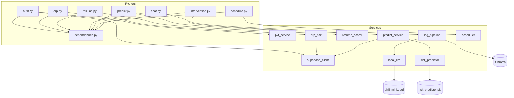
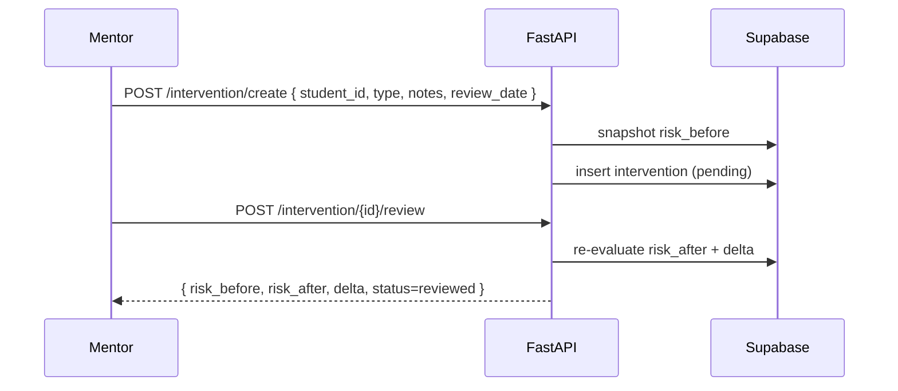
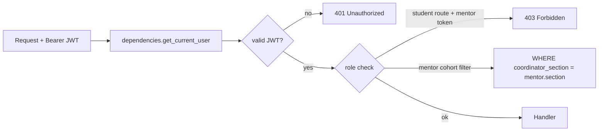

# CampusIQ — Backend (FastAPI)

> FastAPI service for **CampusIQ**: auth (JWT), ERP sync, resume scoring, RAG chat (Chroma + Phi-3-mini offline), risk prediction (XGBoost + SHAP), smart scheduler, and closed-loop mentor interventions. Supabase Postgres as source of truth.

---

## Table of Contents

- [Stack](#stack)
- [Architecture](#architecture)
- [Project Layout](#project-layout)
- [Environment Variables](#environment-variables)
- [Setup & Run](#setup--run)
- [Database Migrations](#database-migrations)
- [API Reference](#api-reference)
- [Services](#services)
- [Auth & RBAC](#auth--rbac)
- [Models & Artifacts](#models--artifacts)
- [Scripts](#scripts)
- [Deployment (Render)](#deployment-render)
- [Troubleshooting](#troubleshooting)

---

## Stack

| Component | Detail |
|---|---|
| Framework | FastAPI + Uvicorn |
| Validation | Pydantic (email, schemas in `models/auth.py`) |
| Auth | PyJWT (`services/jwt_service.py`), `dependencies.get_current_user()` |
| DB | Supabase (Postgres) via `services/supabase_client.py` |
| Vector Store | Chroma (`chroma_db_v3`, persistent) |
| LLM | Phi-3-mini GGUF via `llama-cpp-python` (`services/local_llm.py`) |
| ML | scikit-learn, XGBoost, SHAP, sentence-transformers, spaCy |
| Parsing | PyMuPDF, python-docx, pandas/numpy |
| HTTP | requests, httpx, beautifulsoup4 (ERP scrape) |

---

## Architecture



---

## Project Layout

```
backend/
├── main.py                 # FastAPI app, CORS, router mount, lifespan
├── config.py               # Settings from env (SUPABASE_*, JWT_*, CORS)
├── dependencies.py         # get_current_user, require_role
├── requirements.txt
├── models/
│   ├── auth.py             # Signup/Login schemas, JWT payload
│   ├── risk_predictor.pkl  # XGBoost artifact (trained in ml/predictor)
│   └── phi3-mini.gguf      # Offline LLM (~3.8GB, gitignored, auto-download)
├── routers/
│   ├── auth.py             # POST /auth/signup, /auth/login, GET /auth/me
│   ├── erp.py              # POST /erp/connect, /erp/refresh, GET /erp/status|profile
│   ├── resume.py           # POST /resume/score (multipart)
│   ├── chat.py             # POST /chat/ingest, POST /chat/ask
│   ├── predict.py          # GET /predict/dashboard (student), /predict/cohort (mentor)
│   ├── schedule.py         # POST /schedule/generate
│   └── intervention.py     # POST /intervention/create, POST /intervention/{id}/review
├── services/
│   ├── supabase_client.py  # Supabase init + helpers
│   ├── jwt_service.py      # create/verify JWT
│   ├── erp_psit.py         # Campus ERP scraper (attendance + marks + year/section)
│   ├── resume_scorer.py    # Embedding + keyword scoring vs JD
│   ├── rag_pipeline.py     # Chunk, embed, Chroma store/search
│   ├── local_llm.py        # llama-cpp wrapper, grounded prompt + guardrail
│   ├── risk_predictor.py   # XGBoost load + predict (0.40·marks+0.30·attendance+0.30·resume)
│   ├── predict_service.py  # Dashboard/cohort aggregation + SHAP breakdown
│   └── scheduler.py        # Priority engine → weekly blocks
├── migrations/
│   ├── 001_init.sql
│   ├── 002_student_profiles.sql
│   ├── 003_remove_mock_defaults.sql
│   ├── 004_erp_credentials.sql
│   └── 005_mentor_student_erp.sql
├── scripts/
│   ├── download_model.py   # Fetch phi3-mini.gguf from HF
│   ├── seed_demo.py        # Backdated interventions for demo deltas
│   └── test_e2e.py         # Full integration test
├── chroma_db_v3/           # Persistent Chroma (gitignored)
├── uploads/                # Temp uploads (gitignored)
└── venv/                   # Local venv (gitignored)
```

---

## Environment Variables

Create `backend/.env`:

```env
SUPABASE_URL=https://your-project.supabase.co
SUPABASE_KEY=your-supabase-key
JWT_SECRET=your-random-secret-min-32-chars
JWT_EXPIRE_MINUTES=1440
CORS_ORIGINS=http://localhost:5173
# Deploy: CORS_ORIGINS=*
```

| Var | Required | Notes |
|---|---|---|
| `SUPABASE_URL` | yes | From Supabase dashboard |
| `SUPABASE_KEY` | yes | anon or service_role (service_role for migrations/seed) |
| `JWT_SECRET` | yes | Random 32+ chars, never commit |
| `JWT_EXPIRE_MINUTES` | no | Default `1440` (24h) |
| `CORS_ORIGINS` | no | `http://localhost:5173` locally, `*` on Render |
| `PORT` | no | Render injects `$PORT` |

---

## Setup & Run

```bash
cd backend
python -m venv venv
# Windows
venv\Scripts\activate
# macOS/Linux
source venv/bin/activate

pip install -r requirements.txt

# Optional: pre-download LLM (auto-downloads on first launch if missing)
python scripts/download_model.py

uvicorn main:app --reload --host 127.0.0.1 --port 8000
```

- Health: `GET http://localhost:8000/` → `{"status":"ok"}`
- Swagger: `http://localhost:8000/docs`
- ReDoc: `http://localhost:8000/redoc`

---

## Database Migrations

Run **in order** in Supabase SQL Editor:

| # | File | Creates |
|---|---|---|
| 1 | `001_init.sql` | `users`, `resumes`, `risk_scores`, `interventions`, `chat_feedback` |
| 2 | `002_student_profiles.sql` | `student_profiles` |
| 3 | `003_remove_mock_defaults.sql` | Drops mock defaults |
| 4 | `004_erp_credentials.sql` | `users.erp_id`, `users.erp_password_enc` |
| 5 | `005_mentor_student_erp.sql` | `users.coordinator_section`, `student_profiles.year/section`, RLS |

Verify:

```sql
select table_name from information_schema.tables where table_schema='public';
```

---

## API Reference

> All except `/` and `/auth/*` need `Authorization: Bearer <JWT>`.

### Auth

| Method | Path | Body | Returns |
|---|---|---|---|
| POST | `/auth/signup` | `{ name, email, password, confirm_password, role, branch?, erp_id?, erp_password?, coordinator_section? }` | `{ access_token, user }` |
| POST | `/auth/login` | `{ email, password }` | `{ access_token, user }` |
| GET | `/auth/me` | — | `user` |

Student signup requires `erp_id` + `erp_password`; mentor requires `coordinator_section` (e.g. `CS-III-M`).

### ERP

| Method | Path | Description |
|---|---|---|
| GET | `/erp/status` | Whether ERP linked |
| POST | `/erp/connect` | Scrape ERP, sync attendance/marks/year/section |
| POST | `/erp/refresh` | Re-scrape with stored creds |
| GET | `/erp/profile` | Current synced values |

### Resume

| Method | Path | Body | Returns |
|---|---|---|---|
| POST | `/resume/score` | `multipart: file (PDF/DOCX), job_description (text)` | `{ score, gaps, suggestions }` |

### Chat (RAG)

| Method | Path | Body | Returns |
|---|---|---|---|
| POST | `/chat/ingest` | `multipart: file` | `{ chunks, status }` |
| POST | `/chat/ask` | `{ query }` | `{ answer, sources }` — grounded or "Not found in your documents." |

### Predict

| Method | Path | Returns | Access |
|---|---|---|---|
| GET | `/predict/dashboard` | `{ placementReadiness, academicRisk, breakdown, weakestLink, hasData }` | Student |
| GET | `/predict/cohort` | `{ distribution, students[] }` | Mentor (own cohort) |

### Schedule

| Method | Path | Body | Returns |
|---|---|---|---|
| POST | `/schedule/generate` | `{ subjects[], deadlines[], availableHours }` | `{ detailed_plan, total_study_hours, blocks[] }` |

### Intervention (Closed-Loop)



| Method | Path | Description | Access |
|---|---|---|---|
| POST | `/intervention/create` | Log + snapshot `risk_before` | Mentor |
| POST | `/intervention/{id}/review` | Re-evaluate `risk_after`, compute delta | Mentor |
| GET | `/intervention/student/{student_id}` | List for a student | Mentor / Student (own) |

---

## Services

| Service | Responsibility |
|---|---|
| `supabase_client.py` | Supabase client singleton, query helpers |
| `jwt_service.py` | `create_access_token()`, `verify_token()` |
| `erp_psit.py` | Login to `erp.psit.ac.in`, parse attendance (TL/P/PF/Ab) + marks (ASG/CT), extract `PSIT-CS-III-M` → year/section |
| `resume_scorer.py` | `sentence-transformers` embeddings + `spaCy` keywords → cosine vs JD → 0–100 + gaps |
| `rag_pipeline.py` | Chunk (overlap), embed, upsert to Chroma; search top-k |
| `local_llm.py` | Load `phi3-mini.gguf` via `llama-cpp-python`, grounded prompt, anti-hallucination guardrail |
| `risk_predictor.py` | Load `risk_predictor.pkl`, `predict(placement_readiness)`, risk = 1 - readiness |
| `predict_service.py` | Aggregate dashboard/cohort, compute breakdown (`0.40·marks + 0.30·attendance + 0.30·resume`) + weakest link |
| `scheduler.py` | Priority score deadlines/weak subjects/risk → allocate evening blocks Mon–Sun |

---

## Auth & RBAC



- JWT: `HS256`, `JWT_SECRET`, `exp = now + JWT_EXPIRE_MINUTES`.
- Every router calls `get_current_user`; mentor routes add `require_role("mentor")`.
- Cohort isolation: `predict/cohort` and `intervention` filter by `coordinator_section` (substring match `CS-III-M` ↔ `PSIT-CS-III-M`).

---

## Models & Artifacts

| Artifact | Path | Source | Gitignored |
|---|---|---|---|
| Risk model | `models/risk_predictor.pkl` | Trained in `ml/predictor/train.py` | no (small) |
| LLM | `models/phi3-mini.gguf` | HF `microsoft/Phi-3-mini-4k-instruct-gguf` via `scripts/download_model.py` | yes (~3.8GB) |
| Chroma | `chroma_db_v3/` | Created on first ingest | yes |
| Uploads | `uploads/` | Temp | yes |

---

## Scripts

| Script | Usage |
|---|---|
| `scripts/download_model.py` | `python scripts/download_model.py` — fetch GGUF if missing |
| `scripts/seed_demo.py` | `python scripts/seed_demo.py` — backdated interventions (needs ≥1 mentor + 1 student registered via frontend) |
| `scripts/test_e2e.py` | `python scripts/test_e2e.py` — signup, resume, RAG, RBAC integration test |
| `scripts/run_interventions.py` | Helper for intervention demo |

---

## Deployment (Render)

`render.yaml` at repo root:

```yaml
services:
  - type: web
    name: campusiq-backend
    env: python
    rootDir: backend
    buildCommand: pip install -r requirements.txt
    startCommand: uvicorn main:app --host 0.0.0.0 --port $PORT
    envVars:
      - key: PYTHON_VERSION
        value: 3.10.12
      - key: SUPABASE_URL
        sync: false
      - key: SUPABASE_KEY
        sync: false
      - key: JWT_SECRET
        generateValue: true
      - key: CORS_ORIGINS
        value: "*"
```

> **RAM**: use ≥4GB instance. 512MB free tier will OOM loading `phi3-mini.gguf`.

Set `SUPABASE_URL`, `SUPABASE_KEY`, `JWT_SECRET` in Render dashboard.

---

## Troubleshooting

| Symptom | Fix |
|---|---|
| `No module named 'llama_cpp'` | `pip install llama-cpp-python` (may need CMake/VS Build Tools on Windows) |
| `phi3-mini.gguf not found` | `python scripts/download_model.py` or wait for auto-download on first launch |
| `Invalid ERP credentials` | Check Roll No./Password at `erp.psit.ac.in`; password may have expired |
| `401 Unauthorized` | Missing/expired JWT — re-login; check `JWT_SECRET` matches deploy |
| `CORS error` | Set `CORS_ORIGINS=*` (deploy) or `http://localhost:5173` (local) |
| Supabase `relation does not exist` | Run migrations in order |

---

<p align="center"><sub>See also: <a href="../README.md">Root README</a> · <a href="../frontend/README.md">Frontend</a> · <a href="../ml/README.md">ML</a></sub></p>
