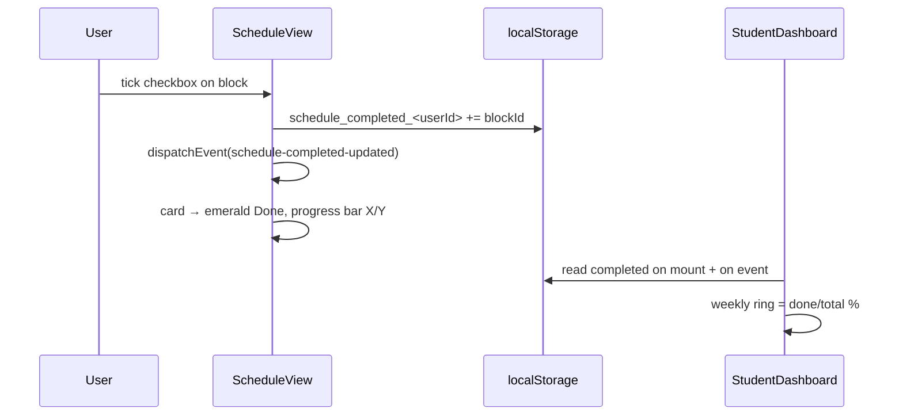
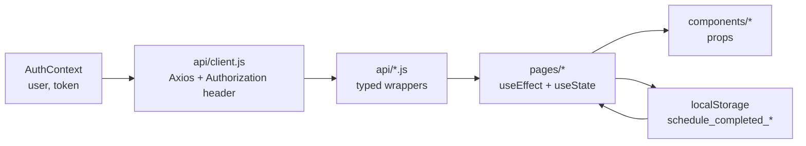

# CampusIQ — Frontend (React + Vite)

> Production-ready React SPA for **CampusIQ** — role-based dashboards (Student / Mentor), ERP connect, resume ATS, RAG chat, smart schedule with real check-off progress, and SHAP explainability. Tailwind CSS 4, React Router 7, Recharts, Axios, Context API.

---

## Table of Contents

- [Stack](#stack)
- [Architecture & Routing](#architecture--routing)
- [Project Layout](#project-layout)
- [Environment Variables](#environment-variables)
- [Setup & Run](#setup--run)
- [Pages](#pages)
- [Components](#components)
- [State & Data Flow](#state--data-flow)
- [Styling](#styling)
- [Build & Deploy (Vercel)](#build--deploy-vercel)
- [Troubleshooting](#troubleshooting)

---

## Stack

| Layer | Tech |
|---|---|
| Framework | React 19, Vite 8 (`@vitejs/plugin-react`) |
| Routing | React Router 7 |
| Styling | Tailwind CSS 4 (`@tailwindcss/vite`), custom `index.css` tokens |
| Charts | Recharts |
| Icons | lucide-react |
| HTTP | Axios (`src/api/client.js` with JWT interceptor) |
| State | Context API (`AuthContext`) + local state + `localStorage` (schedule progress) |
| Lint | oxlint |

---

## Architecture & Routing

```mermaid
graph TB
    subgraph Router["App.jsx — BrowserRouter"]
        PUB1[/login]
        PUB2[/signup]
        PROT1[/student — StudentDashboard]
        PROT2[/interventions — StudentInterventions]
        PROT3[/resume — ResumeScanner]
        PROT4[/study — StudyAssistant]
        PROT5[/schedule — MySchedule]
        PROT6[/mentor — MentorDashboard]
        PROT7[/mentor/students/:id — StudentDetail]
        PROT8[/profile — Profile]
    end
    subgraph Guard["ProtectedRoute.jsx"]
        G{isAuthenticated? role ok?}
    end
    subgraph Context["AuthContext.jsx"]
        C[login / signup / logout<br/>user, token, dashboardPath]
    end
    PUB1 --> C
    PUB2 --> C
    PROT1 --> G --> C
    PROT6 --> G
    PROT7 --> G
```

**Route table** (`src/App.jsx`):

| Path | Component | Access |
|---|---|---|
| `/login` | `Login.jsx` | Public (redirects if authed) |
| `/signup` | `Signup.jsx` | Public |
| `/student` | `StudentDashboard.jsx` | Student |
| `/interventions` | `StudentInterventions.jsx` | Student (own) |
| `/resume` | `ResumeScanner.jsx` | Student / Any JWT |
| `/study` | `StudyAssistant.jsx` | Any JWT |
| `/schedule` | `MySchedule.jsx` | Any JWT |
| `/mentor` | `MentorDashboard.jsx` | Mentor |
| `/mentor/students/:id` | `StudentDetail.jsx` | Mentor |
| `/profile` | `Profile.jsx` | Any JWT |
| `*` | redirect to `dashboardPath(role)` | — |

`dashboardPath(role)` → `/student` or `/mentor`.

---

## Project Layout

```
frontend/
├── index.html
├── vite.config.js          # @vitejs/plugin-react + @tailwindcss/vite
├── vercel.json             # SPA fallback (rewrites → index.html)
├── package.json
├── src/
│   ├── main.jsx            # ReactDOM.createRoot + BrowserRouter
│   ├── App.jsx             # Routes + ProtectedRoute
│   ├── App.css / index.css # Tailwind tokens, animations, utilities
│   ├── api/
│   │   ├── client.js       # Axios instance, baseURL=VITE_API_URL, JWT header
│   │   ├── auth.js         # login, signup, me
│   │   ├── erp.js          # connect, refresh, status, profile
│   │   ├── resume.js       # score (FormData)
│   │   ├── chat.js         # ingest, ask
│   │   ├── predict.js      # getStudentDashboard, getCohortStats, getStudentDetail
│   │   ├── schedule.js     # generateSchedule
│   │   └── intervention.js # create, review, list
│   ├── context/
│   │   └── AuthContext.jsx # user, token, isAuthenticated, login/signup/logout, updateUser
│   ├── components/
│   │   ├── AppLayout.jsx   # Navbar + Sidebar shell
│   │   ├── Navbar.jsx      # Top bar (user, branch, logout)
│   │   ├── Sidebar.jsx     # Role-based nav (student: 6 links, mentor: 2)
│   │   ├── ProtectedRoute.jsx
│   │   ├── ErpConnectModal.jsx   # One-time ERP connect
│   │   ├── RiskTable.jsx         # Cohort table
│   │   ├── ScheduleView.jsx      # Weekly grid + checkbox per block
│   │   ├── InterventionLog.jsx   # Timeline + review
│   │   ├── ResumeUploader.jsx
│   │   ├── ChatWindow.jsx
│   │   ├── LoadingState.jsx
│   │   └── EmptyState.jsx
│   ├── pages/
│   │   ├── Login.jsx
│   │   ├── Signup.jsx
│   │   ├── StudentDashboard.jsx  # 7 cards, ERP marks by test, weekly ring, SHAP entry
│   │   ├── MentorDashboard.jsx   # Cohort overview + RiskTable
│   │   ├── StudentDetail.jsx     # SHAP bars + intervention history + log/review
│   │   ├── StudentInterventions.jsx # Student own interventions
│   │   ├── ResumeScanner.jsx
│   │   ├── StudyAssistant.jsx    # RAG chat + ingest
│   │   ├── MySchedule.jsx        # Generate + check-off + progress bar
│   │   └── Profile.jsx           # Account + score summary + notifications
│   ├── utils/
│   │   └── risk.js         # formatPercent, readinessLabel, riskLabel, reasonBadgeClass, blockCardClass
│   └── assets/
│       ├── hero.png
│       ├── react.svg
│       └── vite.svg
└── dist/                   # vite build output (gitignored)
```

---

## Environment Variables

Create `frontend/.env`:

```env
VITE_API_URL=http://localhost:8000
```

| Var | Required | Notes |
|---|---|---|
| `VITE_API_URL` | yes | Backend base URL; on Vercel set to `https://your-backend.onrender.com` |

> `VITE_` prefix is required for Vite to expose the var to the client.

---

## Setup & Run

```bash
cd frontend
npm install
npm run dev
# → http://localhost:5173
```

| Script | Command | Purpose |
|---|---|---|
| dev | `npm run dev` | Vite dev server + HMR |
| build | `npm run build` | Production build → `dist/` |
| preview | `npm run preview` | Preview `dist` locally |
| lint | `npm run lint` | oxlint |

**Windows note**: if `vite` is not recognized after a WSL `npm install`, re-run `npm install` on Windows to restore `vite.cmd` shims.

---

## Pages

| Page | File | Key features |
|---|---|---|
| **Login** | `Login.jsx` | Email/password, hero image, demo creds hint, JWT via `AuthContext.login()` |
| **Signup** | `Signup.jsx` | Role toggle (student/mentor), student: ERP Roll No. + password (one-time), mentor: `coordinator_section` (e.g. `CS-III-M`), branch optional |
| **Student Dashboard** | `StudentDashboard.jsx` | 7 stat cards (Attendance, Avg marks, Resume, Placement, Risk, Weekly progress ring, Up next), ERP marks by test (filter), weekly ring = `done/total` from `localStorage`, no mock CGPA |
| **Mentor Dashboard** | `MentorDashboard.jsx` | Cohort overview, `RiskTable` (flagged, interventions/month), click → `StudentDetail` |
| **Student Detail** | `StudentDetail.jsx` | SHAP 3 bars (Attendance/Marks/Resume, 30/40/30 weights, contributions, weakest link), intervention timeline (risk_before → risk_after, delta), log/review forms |
| **My Interventions** | `StudentInterventions.jsx` | Student view of own interventions |
| **Resume Scanner** | `ResumeScanner.jsx` | Upload + JD → score 0–100, gaps, tips |
| **Study Assistant** | `StudyAssistant.jsx` | Upload → ingest → chat (grounded) |
| **My Schedule** | `MySchedule.jsx` | Inputs → generate → weekly grid (Mon–Sun, evening blocks), **checkbox per block** → progress bar + `schedule-completed-updated` event |
| **Profile** | `Profile.jsx` | Account edit, score summary, notifications toggles |

---

## Components

| Component | Purpose |
|---|---|
| `AppLayout.jsx` | Shell: `Navbar` (top) + `Sidebar` (left) + `<Outlet />` |
| `Navbar.jsx` | Logo, user name, role · branch, avatar, logout |
| `Sidebar.jsx` | Role-based links (student 6, mentor 2), active state, "AI-powered academic copilot" card |
| `ProtectedRoute.jsx` | Redirect to `/login` if unauthenticated, to `dashboardPath` if wrong role |
| `ErpConnectModal.jsx` | Modal: ERP ID + password, one-time sync, "campus ERP credentials once" |
| `RiskTable.jsx` | Cohort table with risk badges, click-through |
| `ScheduleView.jsx` | Weekly grid, day columns, block cards with **checkbox**, `Done` emerald state, `Clock3` time badge, `Free` empty days |
| `InterventionLog.jsx` | Timeline of interventions, review action |
| `ResumeUploader.jsx` | File drop + JD textarea |
| `ChatWindow.jsx` | Message list + input, source citations |
| `LoadingState.jsx` / `EmptyState.jsx` | Skeletons and empty CTAs |

### Schedule Check-off Flow



- Storage key: `schedule_completed_<userId>` (per-user, survives refresh).
- Event: `window.dispatchEvent(new Event("schedule-completed-updated"))`.
- Regenerating a week clears ticks (new `detailed_plan`).

---

## State & Data Flow



- **Auth**: `login()` / `signup()` store JWT in `localStorage` + set Axios default header; `logout()` clears.
- **ERP**: `StudentDashboard` offers `Connect ERP` or `Refresh ERP`; `ErpConnectModal` calls `erp.connect(id, pw)`.
- **Predict**: `StudentDashboard` → `predict.getStudentDashboard()`; `StudentDetail` → `predict.getStudentDetail(id)` for SHAP.
- **Schedule**: `MySchedule` → `schedule.generateSchedule(payload)` → `ScheduleView` with `detailedPlanToBlocks()`.

---

## Styling

- **Tailwind CSS 4** via `@tailwindcss/vite` — no `tailwind.config.js` needed (v4 uses CSS-first config in `index.css`).
- Tokens: `primary`, `surface`, `ink`, `border`, `risk-*` CSS variables in `index.css`.
- Utilities: `animate-fade-in`, `rounded-[20px]`, `shadow-sm`, `gradient` cards.
- Responsive: `grid-cols-1 sm:grid-cols-2 xl:grid-cols-4`, `hidden lg:block` sidebar.

---

## Build & Deploy (Vercel)

```bash
npm run build
# → dist/index.html + dist/assets/*
```

**Vercel**:

- Import repo, **Root Directory: `frontend`**
- Build command: `npm run build` · Output: `dist`
- Env: `VITE_API_URL=https://your-backend.onrender.com`
- `vercel.json`:

```json
{
  "rewrites": [{ "source": "/(.*)", "destination": "/index.html" }]
}
```

Health:

```bash
curl http://localhost:5173/          # 200
curl https://your-frontend.vercel.app/ # 200
```

---

## Troubleshooting

| Symptom | Fix |
|---|---|
| `vite: command not found` (Windows) | Re-run `npm install` on Windows (WSL symlinks break `vite.cmd`) |
| `Network Error` / CORS | Check `VITE_API_URL` and backend `CORS_ORIGINS` |
| `401 Unauthorized` | Token expired — re-login; check `JWT_SECRET` |
| Blank page + console error | Hard refresh `Ctrl+Shift+R`; check browser console for `hasRisk` TDZ or missing `key` props |
| Schedule progress not updating | Ensure `MySchedule` and `StudentDashboard` share same `userId` key; check `localStorage` in DevTools |

---

<p align="center"><sub>See also: <a href="../README.md">Root README</a> · <a href="../backend/README.md">Backend</a> · <a href="../ml/README.md">ML</a></sub></p>
