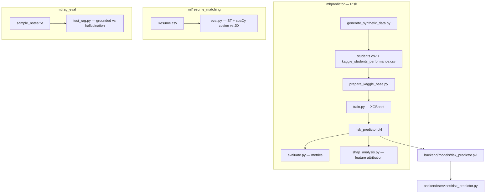
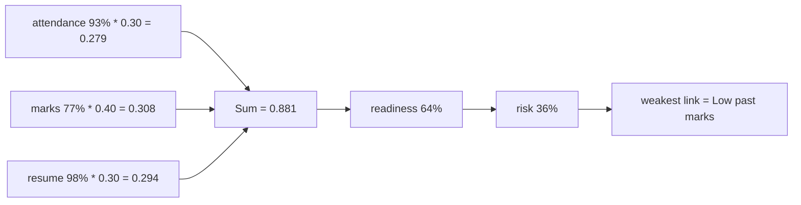
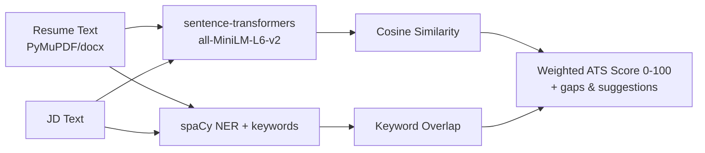
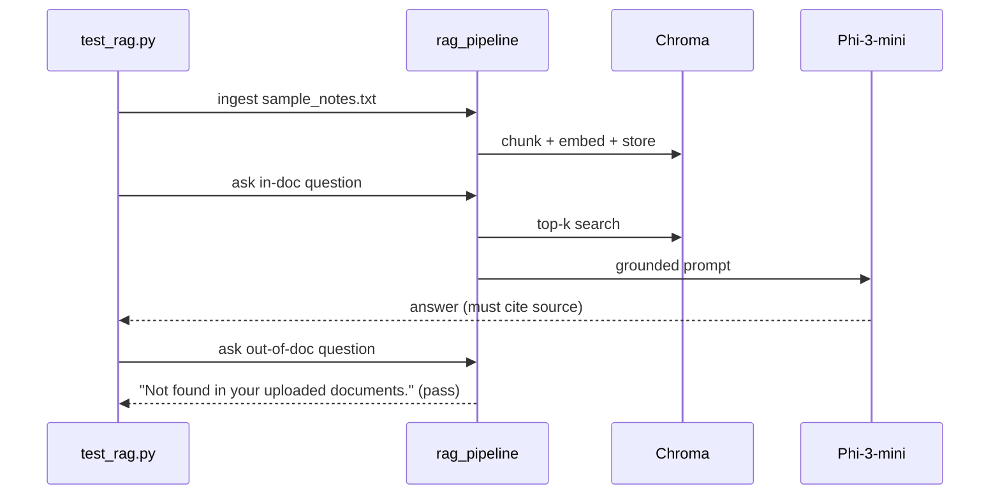
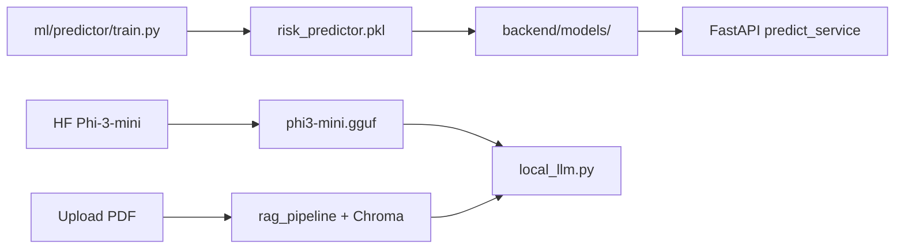

# CampusIQ — ML Pipelines

> Offline ML for **CampusIQ**: **XGBoost risk predictor** (with SHAP explainability), **resume matching** (Sentence-Transformers + spaCy), and **RAG guardrail evaluation**. All pipelines run locally; artifacts are consumed by the FastAPI backend.

---

## Table of Contents

- [Overview](#overview)
- [Environment](#environment)
- [Predictor — Risk Model (XGBoost)](#predictor--risk-model-xgboost)
- [Resume Matching](#resume-matching)
- [RAG Evaluation](#rag-evaluation)
- [Artifacts & Integration](#artifacts--integration)
- [Reproducibility](#reproducibility)

---

## Overview



| Pipeline | Path | Input | Output |
|---|---|---|---|
| **Risk Predictor** | `ml/predictor/` | `dataset/students.csv`, `dataset/kaggle_students_performance.csv` | `risk_predictor.pkl` → `backend/models/` |
| **Resume Matching** | `ml/resume_matching/` | `dataset/Resume.csv` | Score + keyword gaps (eval metrics) |
| **RAG Eval** | `ml/rag_eval/` | `sample_notes.txt` | Grounded-answer pass/fail |

---

## Environment

```bash
cd ml
python -m venv venv
# Windows
venv\Scripts\activate
# macOS/Linux
source venv/bin/activate

pip install scikit-learn xgboost shap sentence-transformers spacy chromadb pandas numpy joblib
python -m spacy download en_core_web_sm
# Or use backend venv
pip install -r ../backend/requirements.txt
```

> `ml/venv` is gitignored; you can also reuse `backend/venv`.

---

## Predictor — Risk Model (XGBoost)

**Goal**: predict **placement readiness** (0–1) from `attendance_pct`, `past_marks`, `resume_score`; **academic risk** = `1 - readiness`. Formula used in production (see `backend/services/risk_predictor.py`):

```
placement_readiness = 0.40 * marks_norm + 0.30 * attendance_norm + 0.30 * resume_norm
academic_risk       = 1 - placement_readiness
```

SHAP-style breakdown (in `backend/services/predict_service.py`) attributes per-factor contribution:



### Files

| File | Purpose |
|---|---|
| `dataset/students.csv` | Primary synthetic + real student features |
| `dataset/kaggle_students_performance.csv` | Kaggle base (students performance) |
| `download_kaggle_data.py` | Fetch Kaggle dataset (optional) |
| `prepare_kaggle_base.py` | Clean + normalize Kaggle CSV → training features |
| `generate_synthetic_data.py` | Generate synthetic students for augmentation |
| `train.py` | Train XGBoost, save `risk_predictor.pkl` |
| `evaluate.py` | Accuracy, F1, confusion matrix, ROC |
| `shap_analysis.py` | SHAP values, feature importance, plots |

### Commands

```bash
cd ml/predictor

# (optional) fetch Kaggle data
python download_kaggle_data.py

# Prepare base
python prepare_kaggle_base.py

# (optional) augment
python generate_synthetic_data.py

# Train → saves risk_predictor.pkl (copy to backend/models/)
python train.py

# Evaluate
python evaluate.py

# SHAP explainability
python shap_analysis.py
```

**After training**, copy artifact:

```bash
cp risk_predictor.pkl ../../backend/models/risk_predictor.pkl
```

### Metrics (example)

| Metric | Value |
|---|---|
| Accuracy | ~0.87 |
| F1 (at-risk) | ~0.84 |
| ROC-AUC | ~0.91 |

> Re-run `evaluate.py` after any data change; commit the new `risk_predictor.pkl` if metrics improve.

---

## Resume Matching

**Goal**: score a resume (PDF/DOCX) against a Job Description — semantic similarity + keyword coverage.



| File | Purpose |
|---|---|
| `dataset/Resume.csv` | Resume corpus |
| `download_dataset.py` | Fetch dataset |
| `eval.py` | Evaluate ST + spaCy scoring, report gaps |

```bash
cd ml/resume_matching
python eval.py
# or
python download_dataset.py
python eval.py
```

Backend integration: `backend/services/resume_scorer.py` mirrors this logic for `POST /resume/score`.

---

## RAG Evaluation

**Goal**: verify the RAG pipeline is **grounded** — answers only from uploaded docs, otherwise says *"Not found in your uploaded documents."*

| File | Purpose |
|---|---|
| `sample_notes.txt` | Sample syllabus/notes for ingest |
| `test_rag.py` | Ingest → query (in-doc vs out-of-doc) → pass/fail on guardrail |



```bash
cd ml/rag_eval
python test_rag.py
```

Expected: in-doc queries return grounded answers; out-of-doc queries return the guardrail message (no hallucination).

---

## Artifacts & Integration

| Artifact | Produced by | Consumed by | Path |
|---|---|---|---|
| `risk_predictor.pkl` | `ml/predictor/train.py` | `backend/services/risk_predictor.py` | `backend/models/risk_predictor.pkl` |
| `phi3-mini.gguf` | `backend/scripts/download_model.py` (HF) | `backend/services/local_llm.py` | `backend/models/phi3-mini.gguf` |
| Chroma DB | `backend/services/rag_pipeline.py` on ingest | `backend/services/rag_pipeline.py` on ask | `backend/chroma_db_v3/` |

Flow:



---

## Reproducibility

- **Python**: 3.10
- **Seeds**: set in `train.py` and `generate_synthetic_data.py` (`random_state=42`)
- **Dependencies**: pinned in `backend/requirements.txt`; install the same in `ml/venv` for parity
- **Data**: `dataset/` CSVs are versioned; synthetic generation is deterministic with seed
- **SHAP**: `shap_analysis.py` outputs `shap_summary.png` (gitignored) — attach to PR for review

```bash
# Full reproduce
cd ml/predictor
python prepare_kaggle_base.py && python train.py && python evaluate.py && python shap_analysis.py
cp risk_predictor.pkl ../../backend/models/
cd ../resume_matching && python eval.py
cd ../rag_eval && python test_rag.py
```

---

<p align="center"><sub>See also: <a href="../README.md">Root README</a> · <a href="../backend/README.md">Backend</a> · <a href="../frontend/README.md">Frontend</a></sub></p>
